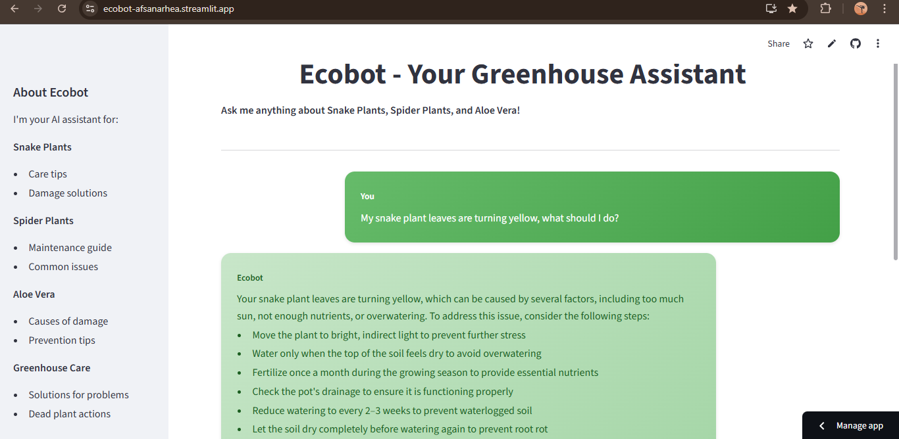

# EcoBot - Plant Care Assistant

A RAG-based chatbot for greenhouse monitoring that provides expert guidance on Snake Plants, Spider Plants, and Aloe Vera care.

## Overview

EcoBot uses Retrieval-Augmented Generation to deliver accurate plant care advice. The system combines FAISS vector search with GROQ Llama 3.3 70B to answer questions based on curated plant care documentation.

## Features

- Semantic search through plant care documentation using FAISS
- Natural language responses powered by GROQ Llama 3.3 70B
- Interactive web interface built with Streamlit
- Specialized knowledge base for three plant types
- Quick action buttons for common plant problems

## Technology Stack

- Python 3.13.7
- LangChain for RAG implementation
- FAISS for vector storage
- Streamlit for web interface
- GROQ API for language model
- HuggingFace Sentence Transformers for embeddings

## Installation

Clone the repository:
```bash
git clone https://github.com/afsanarhea/EcoBot.git
cd EcoBot
```

Create virtual environment:
```bash
python -m venv venv
source venv/bin/activate
```
On Windows use `venv\Scripts\activate`

Install dependencies:
```bash
pip install -r requirements.txt
```

Set up environment variables:
```bash
Create a .env file in the project root
Add your GROQ API key: GROQ_API_KEY=your_api_key_here
```

Get your GROQ API key from https://console.groq.com

## Usage

Build the knowledge base:
```bash
python create_knowledge_base.py
```
This takes 2-3 minutes to process documents and create the vector store.

Run the application:
```bash
streamlit run chatbot_app.py
```

Open your browser and go to http://localhost:8501

## Project Structure
```
EcoBot/
├── chatbot_app.py
├── ecobot_rag.py
├── create_knowledge_base.py
├── data/
│   ├── aloe_vera_guide.txt
│   ├── common_problems.txt
│   ├── snake_plant_guide.txt
│   └── spider_plant_guide.txt
├── requirements.txt
├── .env
└── .gitignore
```

## How It Works

Documents in the data folder are split into chunks and converted to embeddings. FAISS indexes these embeddings for fast retrieval. When you ask a question, the system finds relevant document chunks and sends them to GROQ Llama 3.3 70B to generate a natural language response.

## Upcoming Feature
- Advanced RAG system (coming soon)

## Demo

<p align="center">
  
</p>
